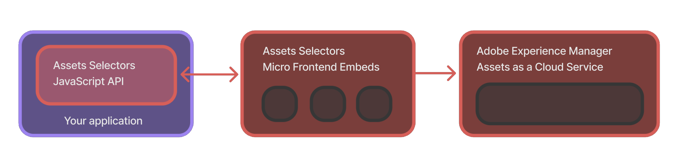

## Assets Selectors

Assets Selectors contains a collection of components such as AssetSelector and DestinationSelector from [Adobe Experience Manager Assets as a Cloud Service][aem-cs-wiki] (AEM CS). These components follow the [Micro Frontend architecture][microfrontend-wiki] and are consumable in your application via convenient JavaScript APIs to search, browse, and retrieve digital assets available in the AEM CS repository.

The _AssetSelector_ component allows you to select and retrieve assets, while the _DestinationSelector_ component enables you to choose a destination to save or move assets to.

## Contents

- [What is this repository for](#what-is-this-repository-for)
- [Installation](#installation)
- [APIs](#apis)
  - [PureJSSelectors.`renderAssetSelector` or `<AssetSelector/>`](#purejsselectorsrenderassetselector-or-assetselector)
  - [PureJSSelectors.`renderAssetSelectorWithAuthFlow` or `<AssetSelectorWithAuthFlow />`](#purejsselectorsrenderassetselectorwithauthflow-or-assetselectorwithauthflow-)
  - [PureJSSelectors.`registerAssetsSelectorsAuthService`](#purejsselectorsregisterassetsselectorsauthservice)
  - [PureJSSelectors.`renderDestinationSelector`](#purejsselectorsrenderdestinationselector-or-destinationselector)
  - [PureJSSelectors.`renderDestinationSelectorWithAuthFlow` or `<DestinationSelectorWithAuthFlow />`](#purejsselectorsrenderdestinationselectorwithauthflow-or-destinationselectorwithauthflow-)
- [Examples](#examples)
  - [JavaScript - UMD](#example---javascript)
  - [JavaScript - ESM](#example---importmap-via-esm-cdn)
  - [React](#example---react-with-importmap-via-esm-cdn)
  - [Angular](#example---angular)
- Supported Properties
  - [AssetSelector Props](./docs/AssetSelectorProps.md)
  - [DestinationSelector Props](./docs/DestinationSelectorProps.md)
  - [ImsAuthProps](./docs/ImsAuthProps.md)
  - [ImsAuthService](./docs/ImsAuthService.md)
- [Contributing](#contributing)
- [Licensing](#licensing)

## What is this repository for

This GitHub repository contains usage examples for the Assets Selectors' JavaScript APIs in various frameworks/libraries, including Vanilla JavaScript, React, Angular, and others. The JavaScript APIs enable you to conveniently integrate Adobe AEM CS assets into your application and support functions such as searching, browsing, retrieving assets and their metadata, renditions, and more.



## Installation

Assets Selectors is available via both ESM CDN (think esm.sh/skypack) and UMD version.

In browsers using UMD version:

```html
<script src="https://experience.adobe.com/solutions/CQ-assets-selectors/assets/resources/assets-selectors.js"></script>

<script>
  const { renderAssetSelector } = PureJSSelectors;
</script>
```

In browsers with [`import maps`][import-maps-wiki] support using ESM CDN version:

```html
<script type="module">
  import { AssetSelector } from 'https://experience.adobe.com/solutions/CQ-assets-selectors/assets/resources/@assets/selectors/index.js'
</script>
```

In Deno/Webpack Module Federation using ESM CDN version:

```js
import { AssetSelector } from 'https://experience.adobe.com/solutions/CQ-assets-selectors/assets/resources/@assets/selectors/index.js'
```

## APIs

This package exports the global identifier `PureJSSelectors` when installed via UMD and named exports `PureJSSelectors, AssetSelector, AssetSelectorWithAuthFlow, DestinationSelector, DestinationSelectorWithAuthFlow, registerAssetsSelectorsAuthService` when installed via ESM. There are no default exports.

Below are the API description exported by this package in identifier `PureJSSelectors` and its equivalent JSX components that are available via ESM imports.
</br>

### PureJSSelectors.`renderAssetSelector` or `<AssetSelector/>`

Renders the AssetSelector component on the provided container element and accepts all of the properties described in the [AssetSelector Props](./docs/AssetSelectorProps.md).

> This method assumes that you supply a valid _imsToken_ that you could have obtained using [`ImsAuthService.getImsToken()`](./docs/ImsAuthService.md) or another medium. If you do not have an _imsToken_, you can use [renderAssetSelectorWithAuthFlow](#purejsselectorsrenderassetselectorwithauthflow-or-assetselectorwithauthflow) which implements an authentication flow to obtain a user based _imsToken_.

###### Parameters

- `container` (`HTMLElement`) — render AssetSelector into the DOM in the supplied container
- `props` (`AssetSelectorProps`) — properties for the AssetSelector component. See [AssetSelector Props](./docs/AssetSelectorProps.md) for more details.
- `onRenderComplete` (`Function?`, default: `undefined`) — optional callback function that is invoked when the component is rendered or updated.

```js
PureJSSelectors.renderAssetSelector(container: HTMLElement, props: AssetSelectorProps, onRenderComplete?: Function): void

// JSX

<AssetSelector {...props} />
```

### PureJSSelectors.`renderAssetSelectorWithAuthFlow` or `<AssetSelectorWithAuthFlow />`

Renders the AssetSelector component on the provided container element and accepts all of the properties described in the [AssetSelector Props](#assetselector-props). The AssetSelectorWithAuthFlow component extends the AssetSelector component to include an authentication flow. When there's no _`imsToken`_ present, the AssetSelectorWithAuthFlow component will show a _Adobe_ login flow to obtain the _imsToken_ and then render the AssetSelector component.

> It is **recommended** that you call [_registerAssetsSelectorsAuthService_](#purejsselectorsregisterassetsselectorsauthservice) on your page load before calling renderAssetSelectorWithAuthFlow or `<AssetSelectorWithAuthFlow/>`. In the event where you cannot call _registerAssetsSelectorsAuthService_,  you can supply [ImsAuthProps](./docs/ImsAuthProps.md) along with [AssetSelectorProps](./docs/AssetSelectorProps.md). However, that might not create a great user experience.

###### Parameters

- `container` (`HTMLElement`) — render AssetSelector into the DOM in the supplied container
- `props` (`AssetSelectorProps`) — properties for the AssetSelector component. See [AssetSelector Props](./docs/AssetSelectorProps.md) for more details.
- `onRenderComplete` (`Function?`, default: `undefined`) — optional callback function that is invoked when the component is rendered or updated.

```js
PureJSSelectors.renderAssetSelectorWithAuthFlow(container: HTMLElement, props: AssetSelectorProps, onRenderComplete?: Function): void

// JSX

<AssetSelectorWithAuthFlow {...props} />
```

### PureJSSelectors.`registerAssetsSelectorsAuthService`

Instantiates the [_ImsAuthService_](./docs/ImsAuthService.md) process. This process registers the authorization service for your AEM CS Assets repository and subscribes to authorization flow events.

> It is recommended that you call this function on your application page load. You must also call this function if you're using the [AssetSelectorWithAuthFlow](#purejsselectorsrenderassetselectorwithauthflow-or-assetselectorwithauthflow) or [DestinationSelectorWithAuthFlow](#purejsselectorsrenderdestinationselectorwithauthflow-or-destinationselectorwithauthflow) components. This API is not required if you're using the [AssetSelector](#purejsselectorsrenderassetselector-or-assetselector) or [DestinationSelector](#purejsselectorsrenderdestinationselector-or-destinationselector) components and already obtained a valid _imsToken_.

##### Parameters

- `authProps` (`ImsAuthProps`) — required properties for the ImsAuthService. See [ImsAuthProps](./docs/ImsAuthProps.md) for more details.

##### Returns

- @returns (`ImsAuthService`) — an instance of the ImsAuthService. See [ImsAuthService](./docs/ImsAuthService.md) for more details.

```js
PureJSSelectors.registerAssetsSelectorsAuthService(authProps: ImsAuthProps): ImsAuthService
```

### PureJSSelectors.`renderDestinationSelector` or `<DestinationSelector/>`

Renders the DestinationSelector component on the provided container element and accepts all of the properties described in the [DestinationSelector Props](./docs/DestinationSelectorProps.md).

> This method assumes that you supply a valid _imsToken_ that you could have obtained using [`ImsAuthService.getImsToken()`](./docs/ImsAuthService.md) or another medium. If you do not have an _imsToken_, you can use [renderDestinationSelectorWithAuthFlow](#purejsselectorsrenderdestinationselectorwithauthflow-or-destinationselectorwithauthflow) which implements an authentication flow to obtain a user based _imsToken_.

###### Parameters

- `container` (`HTMLElement`) — render AssetSelector into the DOM in the supplied container
- `props` (`DestinationSelectorProps`) — properties for the DestinationSelector component. See [DestinationSelector Props](./docs/DestinationSelectorProps.md) for more details.
- `onRenderComplete` (`Function?`, default: `undefined`) — optional callback function that is invoked when the component is rendered or updated.

```js
PureJSSelectors.renderDestinationSelector(container: HTMLElement, props: DestinationSelectorProps, onRenderComplete?: Function): void
```

### PureJSSelectors.`renderDestinationSelectorWithAuthFlow` or `<DestinationSelectorWithAuthFlow />`

Renders the DestinationSelector component on the provided container element and accepts all of the properties described in the [DestinationSelector Props](./docs/DestinationSelectorProps.md). The DestinationSelectorWithAuthFlow component extends the DestinationSelector component to include an authentication flow. When there's no _`imsToken`_ present, the DestinationSelectorWithAuthFlow component will show a _Adobe_ login flow to obtain the _imsToken_ and then render the DestinationSelector component.

> It is **recommended** that you call [_registerAssetsSelectorsAuthService_](#purejsselectorsregisterassetsselectorsauthservice) on your page load before calling renderDestinationSelectorWithAuthFlow or `<DestinationSelectorWithAuthFlow/>`. In the event where you cannot call _registerAssetsSelectorsAuthService_,  you can supply [ImsAuthProps](./docs/ImsAuthProps.md) along with [DestinationSelectorProps](./docs/DestinationSelectorProps.md). However, that might not create a great user experience.

###### Parameters

- `container` (`HTMLElement`) — render DestinationSelector into the DOM in the supplied container
- `props` (`DestinationSelectorProps`) — properties for the DestinationSelector component. See [DestinationSelector Props](./docs/DestinationSelectorProps.md) for more details.
- `onRenderComplete` (`Function?`, default: `undefined`) — optional callback function that is invoked when the component is rendered or updated.

```js
PureJSSelectors.renderDestinationSelectorWithAuthFlow(container: HTMLElement, props: DestinationSelectorProps, onRenderComplete?: Function): void
```

## Examples

Assets Selectors allows you to integrate the AssetSelector and DestinationSelector components into your application using vanilla JavaScript, React, and other frameworks. Below, are some examples of how you can make use of AssetSelector component into your application.

### Example - JavaScript

Assets Selectors UMD version exposes a global variable `PureJSSelectors` which exposes the Asset Selector and Destination Selector [APIs](#apis). Below is an example of how you can use the Asset Selector and Destination Selector components in your application using the built in auth flow. For a more complete and runnable code, refer to the [Vanilla JavaScript demo](./examples/vanilla-js)

```js
// 1. Include the CDN link in your script tag
<script src="https://experience.adobe.com/solutions/CQ-assets-selectors/assets/resources/assets-selectors.js"></script>

// 2. Register the Assets Selectors Auth Service on document load
// Note: it is recommended that you call registerAssetsSelectorsAuthService before you call renderAssetSelectorWithAuthFlow
PureJSSelectors.registerAssetsSelectorsAuthService({
    imsClientId: 'client-id-associate-with-your-aem-assets-repository',
    imsScope: 'additional_info.projectedProductContext,openid',
    redirectUri: window.location.href
});

// 3. Render the AssetSelector component with built in auth flow
const props = {
    imsOrg: "your-aem-assets-repository-ims-org",
    handleSelection: (assets) => {
        ...
    }
}

PureJSSelectors.renderAssetSelectorWithAuthFlow(document.getElementById('asset-selector-container'), props);
```

```html
<!-- In your HTML, AssetSelector will be rendered on to the container element -->
<div id="asset-selector-container"></div>
```

### Example - importMap via ESM CDN

Assets Selectors ESM CDN version exposes `PureJSSelectors` as a named export. As well as React JSX components for Asset Selector and Destination Selector [APIs](#apis). It takes advantage of the browser's new [importMap][import-maps-wiki] feature. This feature allows you to define a mapping of import names to URLs. This is similar to how you would use a package manager like npm or yarn, but without the need for a build step.

> Note: if your project does not have React as a dependency, you will need to include React and ReactDOM in your importMap.

```js
// 1. Supply the browser with importMap specifier
<script type="importmap">
  {
    "imports": {
      "@assets/selectors": "https://experience.adobe.com/solutions/CQ-assets-selectors/assets/resources/@assets/selectors/index.js",
      "react": "https://esm.sh/react@18.2.0",
      "react-dom": "https://esm.sh/react-dom@18.2.0"
    }
  }
  </script>

<script type="module">
  // 2. Import the Assets Selectors components from the alias
  import { registerAssetsSelectorsAuthService, renderAssetSelectorWithAuthFlow } from '@assets/selectors';

  // 3. Register the Assets Selectors Auth Service
  // Note: it is recommended that you call registerAssetsSelectorsAuthService before you call renderAssetSelectorWithAuthFlow
  registerAssetsSelectorsAuthService({
      imsClientId: 'client-id-associate-with-your-aem-assets-repository',
      imsScope: 'additional_info.projectedProductContext,openid',
      redirectUri: window.location.href
  });

  // 4. Render the AssetSelector component with built in auth flow
  const props = {
      imsOrg: "your-aem-assets-repository-ims-org",
      handleSelection: (assets) => {
          ...
      }
  }
  renderAssetSelectorWithAuthFlow(document.getElementById('asset-selector-container'), props);

</script>
```

### Example - React with importMap via ESM CDN

Assets Selectors ESM CDN version also exposes `AssetSelector`, `AssetSelectorWithAuthFlow`, `DestinationSelector`, `DestinationSelectorWithAuthFlow` and `registerAssetsSelectorsAuthService` React JSX components.

> Note: if your project does not have React as a dependency, you will need to include React and ReactDOM in your importMap. For a more complete and runnable code, refer to the [React demo](./examples/react)

```js
// 1. Supply the browser with importMap specifier
<script type="importmap">
  {
    "imports": {
      "@assets/selectors": "https://experience.adobe.com/solutions/CQ-assets-selectors/assets/resources/@assets/selectors/index.js",
      "react": "https://esm.sh/react@18.2.0",
      "react-dom": "https://esm.sh/react-dom@18.2.0"
    }
  }
</script>

<script type="module">
  import React, { useEffect } from 'react';
  import { createRoot } from 'react-dom/client';

  // 2. Import the Assets Selectors components from the alias
  import { AssetSelectorWithAuthFlow, registerAssetsSelectorsAuthService } from '@assets/selectors';

  const App = () => {
    // 3. Register the Assets Selectors Auth Service on component load
    // Note: it is recommended that you call registerAssetsSelectorsAuthService before rendering AssetSelectorWithAuthFlow

    const imsAuthProps = {
        imsClientId: 'client-id-associate-with-your-aem-assets-repository',
        imsScope: 'additional_info.projectedProductContext,openid',
        redirectUri: window.location.href
    };

    useEffect(() => {
        registerAssetsSelectorsAuthService(imsAuthProps);
    }, []);

    // 4. Return and render the AssetSelector component with built in auth flow
    const props = {
        imsOrg: "your-aem-assets-repository-ims-org",
        handleSelection: (assets) => {
            ...
        }
    }

    return <AssetSelectorWithAuthFlow {...props} />;
}

const root = createRoot(document.getElementById('root'));
root.render(<App />);
  
</script>
```

### Example - Angular

You can use the Assets Selectors ESM CDN/UMD version in your Angular application. The following example shows how to use the Assets Selectors in Angular.

> Note: Assets Selectors depend on React you must resolve React as a dependency, before you can use the Assets Selectors in your Angular application. For a more complete and runnable code, refer to the [Angular demo](./examples/angular)

```js
// 1. Include the CDN link in your index.html script tag
<script src="https://experience.adobe.com/solutions/CQ-assets-selectors/assets/resources/assets-selectors.js"></script>

// component code
@Component({
  selector: 'asset-selector',
  template: '<div id="asset-selector"></div>'
})

export class AssetSelectorComponent implements OnInit, AfterViewInit {
  ngOnInit() {
      // 2. Register the Assets Selectors Auth Service on component load
      // Note: it is recommended that you call registerAssetsSelectorsAuthService before calling renderAssetSelectorWithAuthFlow

      const imsAuthProps = {
          imsClientId: 'client-id-associate-with-your-aem-assets-repository',
          imsScope: 'additional_info.projectedProductContext,openid',
          redirectUri: window.location.href
      };
      PureJSSelectors.registerAssetsSelectorsAuthService(imsAuthProps);   
  }

  ngAfterViewInit() {
      // 3. Render the AssetSelector component with built in auth flow
      const props = {
          imsOrg: "your-aem-assets-repository-ims-org",
          handleSelection: (assets) => {
              ...
          }
      }
      PureJSSelectors.renderAssetSelectorWithAuthFlow(document.getElementById('asset-selector'), props);
  }
}
```

```html
// In your template, AssetSelector will be rendered anywhere you're using this selector
<asset-selector></asset-selector>
```

<br/>

### Contributing

Contributions are welcomed! Read the [Contributing Guide](./.github/CONTRIBUTING.md) for more information.

### Licensing

This project is licensed under the Apache V2 License. See [LICENSE](LICENSE) for more information.

<!-- links -->
[aem-cs-wiki]: https://experienceleague.adobe.com/docs/experience-manager-cloud-service/content/assets/home.html
[microfrontend-wiki]: https://en.wikipedia.org/wiki/Microfrontend
[import-maps-wiki]: https://github.com/WICG/import-maps
