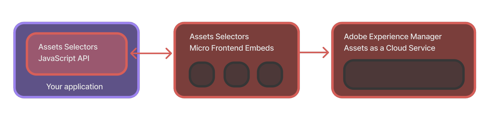

## Assets Selectors

Assets Selectors contains a collection of components such as AssetSelector and DestinationSelector from [Adobe Experience Manager Assets as a Cloud Service][aem-cs-wiki] (AEM CS). These components follow the [Micro Frontend architecture][microfrontend-wiki] and are consumable in your application via convenient JavaScript APIs to search, browse, and retrieve digital assets available in the AEM CS repository.

The _AssetSelector_ component allows you to select and retrieve assets, while the _DestinationSelector_ component enables you to choose a destination to save or move assets to.

## What is this repository for

This GitHub repository contains usage examples for the Assets Selectors' JavaScript APIs in various frameworks/libraries, including Vanilla JavaScript, React, Angular, and others. The JavaScript APIs enable you to conveniently integrate Adobe AEM CS assets into your application and support functions such as searching, browsing, retrieving assets and their metadata, renditions, and more.



This repository provides **runnable code examples** for integrating Assets Selectors in those frameworks. For full API documentation, properties reference, and customization guides, see the [Documentation](#documentation) section below.

## Contents

- [Assets Selectors](#assets-selectors)
- [What is this repository for](#what-is-this-repository-for)
- [Contents](#contents)
- [Installation](#installation)
- [APIs](#apis)
  - [PureJSSelectors.`renderAssetSelector` or `<AssetSelector/>`](#purejsselectorsrenderassetselector-or-assetselector)
  - [PureJSSelectors.`renderAssetSelectorWithAuthFlow` or `<AssetSelectorWithAuthFlow />`](#purejsselectorsrenderassetselectorwithauthflow-or-assetselectorwithauthflow-)
  - [PureJSSelectors.`registerAssetsSelectorsAuthService`](#purejsselectorsregisterassetsselectorsauthservice)
  - [PureJSSelectors.`renderDestinationSelector` or `<DestinationSelector/>`](#purejsselectorsrenderdestinationselector-or-destinationselector)
  - [PureJSSelectors.`renderDestinationSelectorWithAuthFlow` or `<DestinationSelectorWithAuthFlow />`](#purejsselectorsrenderdestinationselectorwithauthflow-or-destinationselectorwithauthflow-)
- [Documentation](#documentation)
- [Examples](#examples)
  - [JavaScript UMD](#javascript-umd)
  - [JavaScript ESM (importMap)](#javascript-esm-importmap)
  - [React (importMap via ESM CDN)](#react-importmap-via-esm-cdn)
  - [Angular](#angular)
- [Usage Data](#usage-data)
- [Contributing](#contributing)
- [Licensing](#licensing)

## Installation

⚠️ This repository is intended to serve as supplemental documentation describing the available APIs and usage examples for integrating Assets Selectors. Before attempting to install or use the Assets Selectors, ensure that your organization has been provisioned to access the Assets Selectors as part of the AEM Assets as a Cloud Service (CS) profile. If you have not been provisioned, you will not be able to successfully integrate or use these components. To request provisioning, your program admin should raise a support ticket marked as P2 from Admin Console and include the following information:

- Program ID and Environment ID for the AEM CS instance
- Domain names where the integrating application is hosted

After provisioning, your organization will be provided with an `imsClientId`, `imsScope`, and a `redirectUrl` corresponding to the environment that you request — which are essential for the configuration of Assets Selectors to work end-to-end. Without those valid properties, you will not be able to integrate with Assets Selectors. For further details, see the [Asset Selector Overview](https://experienceleague.adobe.com/en/docs/experience-manager-cloud-service/content/assets/manage/asset-selector/overview-asset-selector#prereqs) on Experience League.

---

Assets Selectors is available via both ESM CDN (think esm.sh/skypack) and UMD version.

In browsers using UMD version:

```html
<script src="https://experience.adobe.com/solutions/CQ-assets-selectors/static-assets/resources/assets-selectors.js"></script>

<script>
  const { renderAssetSelector } = PureJSSelectors;
</script>
```

In browsers with [`importMap`][import-maps-wiki] support using ESM CDN version:

```html
<script type="module">
  import { AssetSelector } from 'https://experience.adobe.com/solutions/CQ-assets-selectors/static-assets/resources/@assets/selectors/index.js'
</script>
```

In Deno/Webpack Module Federation using ESM CDN version:

```js
import { AssetSelector } from 'https://experience.adobe.com/solutions/CQ-assets-selectors/static-assets/resources/@assets/selectors/index.js'
```

## APIs

This package exports the global identifier `PureJSSelectors` when installed via UMD and named exports `PureJSSelectors`, [`AssetSelector`](#purejsselectorsrenderassetselector-or-assetselector), [`AssetSelectorWithAuthFlow`](#purejsselectorsrenderassetselectorwithauthflow-or-assetselectorwithauthflow-), [`DestinationSelector`](#purejsselectorsrenderdestinationselector-or-destinationselector), [`DestinationSelectorWithAuthFlow`](#purejsselectorsrenderdestinationselectorwithauthflow-or-destinationselectorwithauthflow-), [`registerAssetsSelectorsAuthService`](#purejsselectorsregisterassetsselectorsauthservice) when installed via ESM. There are no default exports.

Below are the API descriptions exported by this package in identifier `PureJSSelectors` and their equivalent JSX components that are available via ESM imports.

### PureJSSelectors.`renderAssetSelector` or `<AssetSelector/>`

Renders the AssetSelector component on the provided container element and accepts all of the properties described in the [AssetSelector Props](./docs/AssetSelectorProps.md).

> This method assumes that you supply a valid _imsToken_ that you could have obtained using [`ImsAuthService.getImsToken()`](./docs/ImsAuthService.md) or another medium. If you do not have an _imsToken_, you can use [renderAssetSelectorWithAuthFlow](#purejsselectorsrenderassetselectorwithauthflow-or-assetselectorwithauthflow-) which implements an authentication flow to obtain a user based _imsToken_.

<!-- omit in toc -->
###### Parameters

- `container` (`HTMLElement`) — render AssetSelector into the DOM in the supplied container
- `props` (`AssetSelectorProps`) — properties for the AssetSelector component. See [AssetSelector Props](./docs/AssetSelectorProps.md) for more details.
- `onRenderComplete` (`Function?`, default: `undefined`) — optional callback function that is invoked when the component is rendered or updated.

```js
PureJSSelectors.renderAssetSelector(container: HTMLElement, props: AssetSelectorProps, onRenderComplete?: Function): void

// JSX

<AssetSelector {...props} />
```

### PureJSSelectors.`renderAssetSelectorWithAuthFlow` or `<AssetSelectorWithAuthFlow />`

Renders the AssetSelector component on the provided container element and accepts all of the properties described in the [AssetSelector Props](./docs/AssetSelectorProps.md). The AssetSelectorWithAuthFlow component extends the AssetSelector component to include an authentication flow. When there's no _`imsToken`_ present, the AssetSelectorWithAuthFlow component will show a _Adobe_ login flow to obtain the _imsToken_ and then render the AssetSelector component.

> It is **recommended** that you call [_registerAssetsSelectorsAuthService_](#purejsselectorsregisterassetsselectorsauthservice) on your page load before calling renderAssetSelectorWithAuthFlow or `<AssetSelectorWithAuthFlow/>`. In the event where you cannot call _registerAssetsSelectorsAuthService_, you can supply [ImsAuthProps](./docs/ImsAuthProps.md) along with [AssetSelectorProps](./docs/AssetSelectorProps.md). However, that might not create a great user experience.

<!-- omit in toc -->
###### Parameters

- `container` (`HTMLElement`) — render AssetSelector into the DOM in the supplied container
- `props` (`AssetSelectorProps`) — properties for the AssetSelector component. See [AssetSelector Props](./docs/AssetSelectorProps.md) for more details.
- `onRenderComplete` (`Function?`, default: `undefined`) — optional callback function that is invoked when the component is rendered or updated.

```js
PureJSSelectors.renderAssetSelectorWithAuthFlow(container: HTMLElement, props: AssetSelectorProps, onRenderComplete?: Function): void

// JSX

<AssetSelectorWithAuthFlow {...props} />
```

### PureJSSelectors.`registerAssetsSelectorsAuthService`

Instantiates the [_ImsAuthService_](./docs/ImsAuthService.md) process. This process registers the authorization service for your AEM CS Assets repository and subscribes to authorization flow events.

> It is recommended that you call this function on your application page load. You must also call this function if you're using the [AssetSelectorWithAuthFlow](#purejsselectorsrenderassetselectorwithauthflow-or-assetselectorwithauthflow-) or [DestinationSelectorWithAuthFlow](#purejsselectorsrenderdestinationselectorwithauthflow-or-destinationselectorwithauthflow-) components. This API is not required if you're using the [AssetSelector](#purejsselectorsrenderassetselector-or-assetselector) or [DestinationSelector](#purejsselectorsrenderdestinationselector-or-destinationselector) components and already obtained a valid _imsToken_.

<!-- omit in toc -->
##### Parameters

- `authProps` (`ImsAuthProps`) — required properties for the ImsAuthService. See [ImsAuthProps](./docs/ImsAuthProps.md) for more details.

<!-- omit in toc -->
##### Returns

- @returns (`ImsAuthService`) — an instance of the ImsAuthService. See [ImsAuthService](./docs/ImsAuthService.md) for more details.

```js
PureJSSelectors.registerAssetsSelectorsAuthService(authProps: ImsAuthProps): ImsAuthService
```

### PureJSSelectors.`renderDestinationSelector` or `<DestinationSelector/>`

Renders the DestinationSelector component on the provided container element and accepts all of the properties described in the [DestinationSelector Props](./docs/DestinationSelectorProps.md).

> This method assumes that you supply a valid _imsToken_ that you could have obtained using [`ImsAuthService.getImsToken()`](./docs/ImsAuthService.md) or another medium. If you do not have an _imsToken_, you can use [renderDestinationSelectorWithAuthFlow](#purejsselectorsrenderdestinationselectorwithauthflow-or-destinationselectorwithauthflow-) which implements an authentication flow to obtain a user based _imsToken_.

<!-- omit in toc -->
###### Parameters

- `container` (`HTMLElement`) — render DestinationSelector into the DOM in the supplied container
- `props` (`DestinationSelectorProps`) — properties for the DestinationSelector component. See [DestinationSelector Props](./docs/DestinationSelectorProps.md) for more details.
- `onRenderComplete` (`Function?`, default: `undefined`) — optional callback function that is invoked when the component is rendered or updated.

```js
PureJSSelectors.renderDestinationSelector(container: HTMLElement, props: DestinationSelectorProps, onRenderComplete?: Function): void
```

### PureJSSelectors.`renderDestinationSelectorWithAuthFlow` or `<DestinationSelectorWithAuthFlow />`

Renders the DestinationSelector component on the provided container element and accepts all of the properties described in the [DestinationSelector Props](./docs/DestinationSelectorProps.md). The DestinationSelectorWithAuthFlow component extends the DestinationSelector component to include an authentication flow. When there's no _`imsToken`_ present, the DestinationSelectorWithAuthFlow component will show a _Adobe_ login flow to obtain the _imsToken_ and then render the DestinationSelector component.

> It is **recommended** that you call [_registerAssetsSelectorsAuthService_](#purejsselectorsregisterassetsselectorsauthservice) on your page load before calling renderDestinationSelectorWithAuthFlow or `<DestinationSelectorWithAuthFlow/>`. In the event where you cannot call _registerAssetsSelectorsAuthService_, you can supply [ImsAuthProps](./docs/ImsAuthProps.md) along with [DestinationSelectorProps](./docs/DestinationSelectorProps.md). However, that might not create a great user experience.

<!-- omit in toc -->
###### Parameters

- `container` (`HTMLElement`) — render DestinationSelector into the DOM in the supplied container
- `props` (`DestinationSelectorProps`) — properties for the DestinationSelector component. See [DestinationSelector Props](./docs/DestinationSelectorProps.md) for more details.
- `onRenderComplete` (`Function?`, default: `undefined`) — optional callback function that is invoked when the component is rendered or updated.

```js
PureJSSelectors.renderDestinationSelectorWithAuthFlow(container: HTMLElement, props: DestinationSelectorProps, onRenderComplete?: Function): void
```

## Documentation

For complete documentation on Assets Selectors — including full property reference, `ImsAuthProps`, customization guides, and scenario-specific examples — visit the following Experience League pages:

| Topic | What you'll find | Link |
|-------|------------------|------|
| Overview | What Asset Selector is, provisioning prerequisites, architecture | [Micro-Frontend Asset Selector Overview](https://experienceleague.adobe.com/en/docs/experience-manager-cloud-service/content/assets/manage/asset-selector/overview-asset-selector) |
| Properties Reference | Full prop tables for `AssetSelector`, `DestinationSelector`, and `ImsAuthProps` | [Asset Selector Properties](https://experienceleague.adobe.com/en/docs/experience-manager-cloud-service/content/assets/manage/asset-selector/asset-selector-properties) |
| Customizations | Filters, i18n, theming, feature flags, repository switching | [Asset Selector Customizations](https://experienceleague.adobe.com/en/docs/experience-manager-cloud-service/content/assets/manage/asset-selector/asset-selector-customization) |
| Usage Examples | Additional framework- and scenario-specific snippets | [Asset Selector Examples](https://experienceleague.adobe.com/en/docs/experience-manager-cloud-service/content/assets/manage/asset-selector/asset-selector-examples) |
| Dynamic Media OpenAPI | Integrating with Dynamic Media Open APIs | [Integrate with Dynamic Media Open APIs](https://experienceleague.adobe.com/en/docs/experience-manager-cloud-service/content/assets/manage/asset-selector/asset-selector-integration/integrate-asset-selector-dynamic-media-open-api) |

## Examples

Each example directory contains a self-contained project with its own instructions:

- **[Vanilla JavaScript](./examples/vanilla-js/)** — Plain HTML/CSS/JS using the UMD build from Adobe CDN
- **[React](./examples/react/)** — React 18 + Vite application
- **[Angular](./examples/angular/)** — Angular 14 application

The following sections include minimal snippets showing the shape of integration in each framework. Every snippet follows the same two-step pattern: **(1)** register the auth service on page/component load, then **(2)** render the selector with the built-in auth flow. The full runnable projects in [`examples/`](./examples) show the same APIs with a richer UI shell around them.

### JavaScript UMD

UMD exposes the API on a global `PureJSSelectors`. Full example: [`examples/vanilla-js/`](./examples/vanilla-js).

```html
<script src="https://experience.adobe.com/solutions/CQ-assets-selectors/static-assets/resources/assets-selectors.js"></script>
<div id="asset-selector-container"></div>

<script>
  PureJSSelectors.registerAssetsSelectorsAuthService({
    imsClientId: '<IMS_CLIENT_ID>',
    imsScope: 'AdobeID,openid,additional_info.projectedProductContext,read_organizations',
    redirectUrl: window.location.href,
  });

  PureJSSelectors.renderAssetSelectorWithAuthFlow(
    document.getElementById('asset-selector-container'),
    {
      imsOrg: null, // or "your-aem-assets-repository-ims-org" to pin to a single org
      handleSelection: (assets) => { /* ... */ },
    }
  );
</script>
```

For `DestinationSelector`, swap `renderAssetSelectorWithAuthFlow` → `renderDestinationSelectorWithAuthFlow` and `handleSelection` → `onConfirm`.

### JavaScript ESM (importMap)

ESM exposes the same functions as named exports via an [importMap][import-maps-wiki]. Your project must resolve React and ReactDOM; the map below pulls them from esm.sh.

```html
<script type="importmap">
{
  "imports": {
    "@assets/selectors": "https://experience.adobe.com/solutions/CQ-assets-selectors/static-assets/resources/@assets/selectors/index.js",
    "react": "https://esm.sh/react@18.2.0",
    "react-dom": "https://esm.sh/react-dom@18.2.0"
  }
}
</script>
<div id="asset-selector-container"></div>

<script type="module">
  import { registerAssetsSelectorsAuthService, renderAssetSelectorWithAuthFlow } from '@assets/selectors';

  registerAssetsSelectorsAuthService({
    imsClientId: '<IMS_CLIENT_ID>',
    imsScope: 'AdobeID,openid,additional_info.projectedProductContext,read_organizations',
    redirectUrl: window.location.href,
  });

  renderAssetSelectorWithAuthFlow(
    document.getElementById('asset-selector-container'),
    {
      imsOrg: null, // or "your-aem-assets-repository-ims-org" to pin to a single org
      handleSelection: (assets) => { /* ... */ },
    }
  );
</script>
```

### React (importMap via ESM CDN)

ESM also exports React components: `AssetSelector`, `AssetSelectorWithAuthFlow`, `DestinationSelector`, `DestinationSelectorWithAuthFlow`. Full example: [`examples/react/`](./examples/react).

**Using the built-in auth flow** — the most common path:

```jsx
import React, { useEffect } from 'react';
import { createRoot } from 'react-dom/client';
import { AssetSelectorWithAuthFlow, registerAssetsSelectorsAuthService } from '@assets/selectors';

const App = () => {
  useEffect(() => {
    registerAssetsSelectorsAuthService({
      imsClientId: '<IMS_CLIENT_ID>',
      imsScope: 'AdobeID,openid,additional_info.projectedProductContext,read_organizations',
      redirectUrl: window.location.href,
    });
  }, []);

  return (
    <AssetSelectorWithAuthFlow
      imsOrg={null} // or "your-aem-assets-repository-ims-org" to pin to a single org
      handleSelection={(assets) => { /* ... */ }}
    />
  );
};

createRoot(document.getElementById('root')).render(<App />);
```

**Bring your own `imsToken`** — use the plain `<AssetSelector />` when your app already has a valid token:

```jsx
import { AssetSelector } from '@assets/selectors';

<AssetSelector
  imsOrg={null}
  imsToken="<YOUR_VALID_IMS_TOKEN>"
  handleSelection={(assets) => { /* ... */ }}
/>
```

### Angular

Angular consumes the UMD build via a `<script>` in `index.html` and the global `PureJSSelectors`. Full example: [`examples/angular/`](./examples/angular).

```ts
declare const PureJSSelectors: any;

@Component({
  selector: 'asset-selector',
  template: '<div id="asset-selector" style="height: 100vh"></div>',
})
export class AssetSelectorComponent implements OnInit, AfterViewInit {
  ngOnInit() {
    PureJSSelectors.registerAssetsSelectorsAuthService({
      imsClientId: '<IMS_CLIENT_ID>',
      imsScope: 'AdobeID,openid,additional_info.projectedProductContext,read_organizations',
      redirectUrl: window.location.href,
    });
  }

  ngAfterViewInit() {
    PureJSSelectors.renderAssetSelectorWithAuthFlow(
      document.getElementById('asset-selector'),
      {
        imsOrg: null, // or "your-aem-assets-repository-ims-org" to pin to a single org
        handleSelection: (assets: unknown) => { /* ... */ },
      }
    );
  }
}
```

## Usage Data

By default, Assets Selectors collect usage data to help improve the product. If you wish to opt out of any usage data collection, you can do so by setting the `disableTracking` property to `true` in the AssetSelector or DestinationSelector props. See the [Properties Reference](https://experienceleague.adobe.com/en/docs/experience-manager-cloud-service/content/assets/manage/asset-selector/asset-selector-properties) for details.

## Contributing

Contributions are welcomed! Read the [Contributing Guide](./.github/CONTRIBUTING.md) for more information.

## Licensing

This project is licensed under the Apache V2 License. See [LICENSE](LICENSE) for more information.

<!-- links -->
[aem-cs-wiki]: https://experienceleague.adobe.com/docs/experience-manager-cloud-service/content/assets/home.html
[microfrontend-wiki]: https://en.wikipedia.org/wiki/Microfrontend
[import-maps-wiki]: https://github.com/WICG/import-maps
